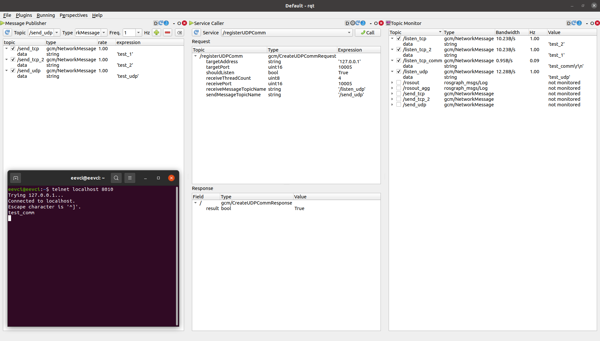

# Generic Communication Manager 

## 1) Introduction
GCM (Generic Communication Manager) provides abstract communication layer through ROS. Communication interfaces can be establish by calling specified services. GCM also can make applications or business logic easily testable due to abstraction of communication. 
For now you can communicate with protocols below;

* UDP
* TCP

GCM is implemented with heavily used optimized async boost functions.   

## 2) Dependencies
* roscpp
* std_msgs 
* message_generation 

packages are used in this project.

## 3) Tests
### Unit tests
 There multiple different test scenarios for all network drivers. 

 Small messages or long messages send through network single or multiple times at the same time. 

 To run unit tests, you should first compile it with;
 
 	catkin build --catkin-make-args run_tests
 	
  After that, you run tests with;
  
  	rosrun gcm gcm_test 
 	 

 

### Build and Start

To run, you should first compile it with;
 
 	catkin build
Then;
	rosrun gcm gcm_node

### Design
All code is written in C++.
ROS Noetic is used for this project.
 
